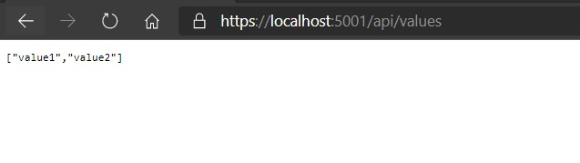

# Module 3: Creating and Consuming ASP.NET Core Web APIs

# Lesson 2: Creating an ASP.NET Core Web API

### Demonstration: Creating Your First ASP.NET Core Web API

- Crear un nuevo proyecto **ASP.NET Core Web API** en Visual Studio Code desde la consola
- Ejecutar

